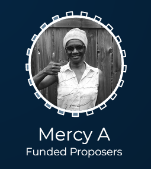

# Proposers' Hub

## Quick Start - [FAQ](https://catalyst-circle.gitbook.io/catalyst-coordinator/information/faq)

In a hurry ? [Go to this section](https://catalyst-circle.gitbook.io/catalyst-coordinator/information/faq) to read the essentials a funded proposer needs to know.

## What is the Catalyst Coordinator ?

The "Catalyst Coordinator" is everyone who has been funded by the Project Catalyst Experiment, in any Fund.\
\
Coordinator meetings take place on Zoom, every second Tuesday. You will be sent a link when you receive your onboarding information as a newly-funded proposer.\
\
Coordinator meetings are not compulsory. They are at an inconvenient time for some parts of the globe; and hopefully in future there will be meetings to suit all time zones.

## Contact your Catalyst Circle Rep

### Email - funded-proposers@catalystcircle.io

[See here for more details about Funded Proposer representation on Catalyst Circle](https://catalyst-circle.gitbook.io/catalyst-coordinator/circle-representation)

