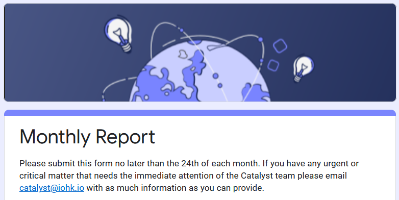

# Quick Start - FAQ

## On-boarding

Once funded you will receive an email providing instructions and you will be required to attend an on-boarding meeting for "proof of life".


See the [on-boarding section](https://quality-assurance-dao.gitbook.io/catalyst-coordinator/coordinator-processes/onboarding) for further information


## Funds

After you have completed a "_proof of life_" you will receive a [test transaction](https://quality-assurance-dao.gitbook.io/catalyst-coordinator/coordinator-processes/funds#test-transactions) to the ADA wallet you specified in your on-boarding form.

After you have confirmed your test transaction a portion of the funds granted in your proposal will be released.


See the [Funds section ](../funds/funds.md)for further information


## Monthly Reporting

### **One report is required per proposal on the 24th of every month**

Follow this [link ](https://docs.google.com/forms/d/e/1FAIpQLSdS6wAzKdSR1mAwCHP0EkVqOVlszvU5E45B0G2-0HmjO6qgbA/viewform)to the monthly reporting form.


See the [Reporting section](../reporting/reporting.md) for further information


## Coordinator (Funded Cohort) Meetings

Coordinator (Funded Cohort) Meetings are held every two weeks. The IOHK Team hosts and presents relevant announcements and information. Then Coordinators give "Stand up" updates on their proposals.


See the [Meetings section](meetings.md) for further information


## List of Funded Proposals

#### [Link to Google Sheet](https://docs.google.com/spreadsheets/d/1bfnWFa94Y7Zj0G7dtpo9W1nAYGovJbswipxiHT4UE3g/edit?usp=sharing)


