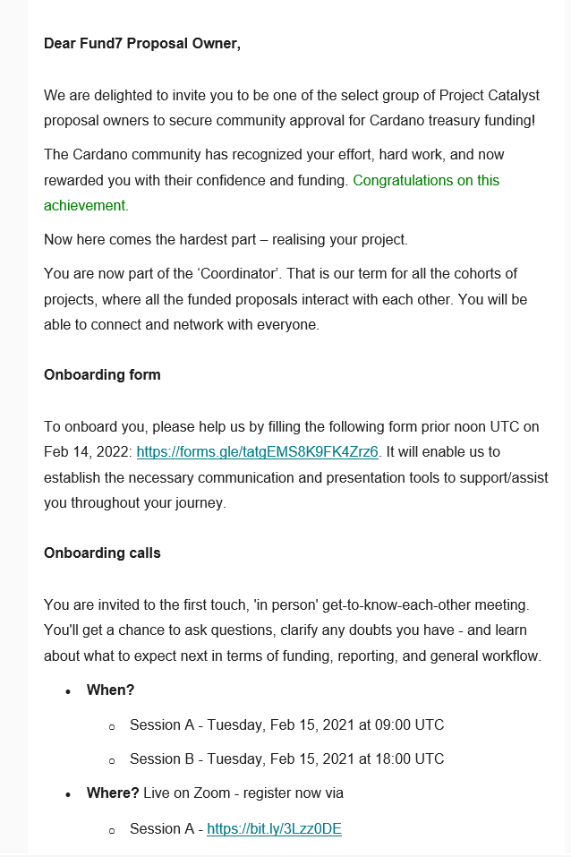

# F7 : Onboarding

## Fund 7 Onboarding

### Slides


The presentation prepared by IOG and viewed at the on boarding meeting for Fund 7.


### On-boarding email

### Feedback

#### How useful did you find this meeting ?

.png>)

> good to get acquainted

> For already funded members it could be not that useful

> As a first timer, I'm much more comfortable to run the project after the meeting.

> asynchronous stand up would be great! Onboarding all together is a nice experience and shouldnt be dismissed. But successive "standups" can be asynchronous with a short video

> We could have async proof of life. Bringing everyone together is different rooms takes a lot of time.

> the intro could have been more concise

> It would be great to obtain email addresses/contact of funded proposers. It seems that keeping in touch with them after the meeting would be a challenge. Some are reluctant to join communication channels and keen to provide only reports.

> Would be great to have the bi weekly meetings with the challenge teams would safe everyone time and keep a cohesive group. Would be great to have a video submission link so we don't have to attend regulalry in person and we can submit the update via video.

> The initial presentation was poor, too long and verbose, the infos in it could have been presented much more succinctly. At the end, some people in the audience even had to intervene to make the presenters to respect people's time and move everybody in break out rooms. Q\&A could have been done in break out rooms. But the break out rooms were good.

> hope meeting schedule or resume

> The agenda was unclear. The introduction of Challenge teams was uncoordinated, not even them were sure what to do. On the break out room we had no idea what to do, the challenge team member had also no idea what to do and how the proof of life process was to proceed.

> If the point is just to get them on record saying "I'm thisandthat from this team with this proposal" there are better ways to do it. Now people were hopping from room to room trying to announce them. We did take "confessions" also for proposals outside of our challenge if people had many. Heinz called the process "project junk". :)

> So far, everything great

> unnecessary process, waste of time... challenge teams intros were unnecessary

> The maingoal is to have a proof of live... the current format used, its time consuming without any additional outcomes

#### Was the meeting at a convenient time ?

.png>)

#### What did you think of the length of the meeting ?

.png>)

#### Any suggestions for improvements next time ?

> Well done

> try to get all ct's to attend

> Facilitate proposers who are in more than one challenge setting for proof of life.

> I think the inclusion of the CT per Challenge was a great move into the proper direction!!

> no Q\&A in the main session, considering the large numbers of participants. Thank you.

> see above

> Most of the information could be delivered via email, doesn't necessarily have to be duringa meeting.

> It would be great to get the consent of funded proposers to provide the challenge team with email addresses or any forms of contact at all. The format of reporting has already been changed from bi-monthly to monthly yet some funded proposers in previous funding rounds are still adhering to the old format. Very smooth meeting, much more efficient this time, thank you for this!

> Make the presentation at the start much shorter, by using less rhetoric. The presenter does not need to convince us of anything or make speeches, please just give the information needed.

> Be clearer about whether people who are funded in multiple different challenges need to go from room to room or not. Please kindly give more detail information about when will we get the first batch of fund for Catalyst Fund 7 proposal. So we could prepare to run the project. Thank you.

> Have a clear agenda.

> Challenge Team are they to help, they should know what to do. If they have to record the meeting they need host rights

> Find a way to let "mass proposers" to tick the box in some other way.

> Not for now

> don't have this meeting..

> less time in main rooms, more time for breakout rooms

> This could be a pre-recorded information video, and proof of life can be a video we all send in, since Marek is going to watch all the proof of life recordings anyway. Have the two meetings be optional and shorter for those that still have questions and want to chat.

> I think making Proof Of Life at the beginning of the call would help some people that cannot really stay for long in the call.
